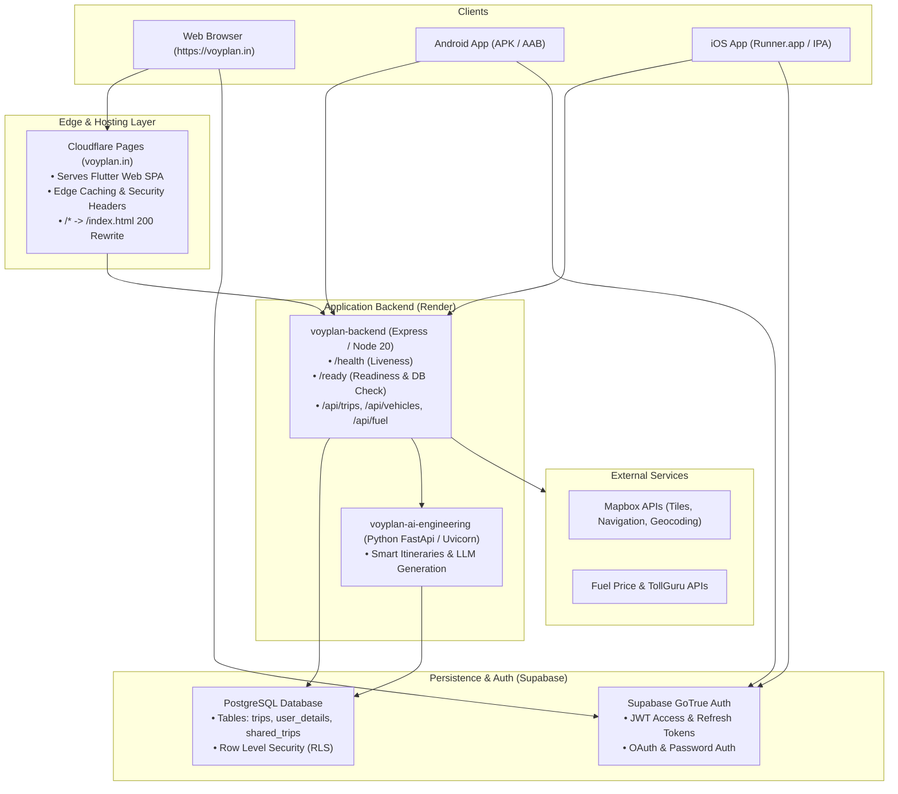

# VoyPlan Architecture Documentation

## 1. System Overview

VoyPlan is an end-to-end intelligent road trip and itinerary planning platform consisting of:
- **Frontend SPA**: Flutter Web application served globally via Cloudflare Pages edge network (`https://voyplan.in`).
- **Mobile Native Applications**: Flutter codebase compiled for Android (APK/AAB) and iOS (`Runner.app` / IPA).
- **Backend API**: Node.js / Express microservice deployed on Render (`https://api.voyplan.in` or `voyplan-backend`).
- **Database & Authentication**: Supabase Postgres with Row Level Security (RLS) and GoTrue Auth (`https://dtemayjpttktntooxraa.supabase.co`).
- **AI & Optimization Services**: Python AI Engineering service (`voyplan-ai-engineering` on Render) providing LLM-assisted trip recommendations, route optimization, and day planning.
- **External Services**: Mapbox Navigation / Geocoding APIs, OpenStreetMap / OSRM routing, TollGuru, and live fuel price APIs.

---

## 2. Infrastructure & Topology

| Component | Provider | URL / Endpoint | Purpose |
|---|---|---|---|
| **Web Frontend** | Cloudflare Pages | `https://voyplan.in` | Global CDN hosting Flutter Web SPA (`mobile/build/web`) |
| **Backend API** | Render Web Service | `https://api.voyplan.in` | Express API, auth verification, fuel, vehicles, metrics |
| **AI Engineering** | Render Web Service | Private/Internal | LLM itinerary generation and trip recommendations |
| **Database & Auth** | Supabase Cloud | `https://dtemayjpttktntooxraa.supabase.co` | PostgreSQL with RLS, GoTrue authentication engine |
| **DNS Management** | Cloudflare DNS | `voyplan.in`, `api.voyplan.in` | DNSSEC, SSL Termination, edge routing |
| **CI / CD** | GitHub Actions | Workflows in `.github/workflows/` | PR verification, mobile APK artifacts, production deployment |

---

## 3. Data Flow & Authentication Lifecycle

1. **User Authentication**:
   - The client invokes `Supabase.instance.client.auth.signInWithPassword()` directly to Supabase Auth over HTTPS.
   - Upon authentication, Supabase returns a JSON Web Token (`access_token`) and a long-lived `refresh_token`.
   - The Flutter client securely persists the session using platform storage (`SharedPreferences` on mobile, `localStorage` on web).

2. **API Requests**:
   - Client attaches the token in the HTTP Authorization header: `Authorization: Bearer <access_token>`.
   - The backend API (`backend/src/middleware/auth.js`) verifies the JWT against `SUPABASE_JWT_SECRET` using HMAC-SHA256.
   - If valid, `req.user` is populated with `user_id` and role; otherwise, HTTP 401 is returned.

3. **Database Queries**:
   - Direct client queries to Supabase Postgres leverage Postgres RLS policies based on `auth.uid() = user_id`.
   - Backend queries use service role keys or user-delegated tokens to ensure data segregation.

---

## 4. Reliability & Health Probes

- **Liveness Probe**: `GET /health` returns `{ "status": "ok", "version": "2.4.0", "timestamp": ... }` within < 100ms.
- **Readiness Probe**: `GET /ready` actively verifies:
  - Database connectivity to Supabase.
  - Presence of essential environment configurations (`SUPABASE_URL`, `SUPABASE_ANON_KEY`).
  - Returns HTTP 200 `{ "status": "ready", ... }` or HTTP 503 `{ "status": "degraded", ... }`.
