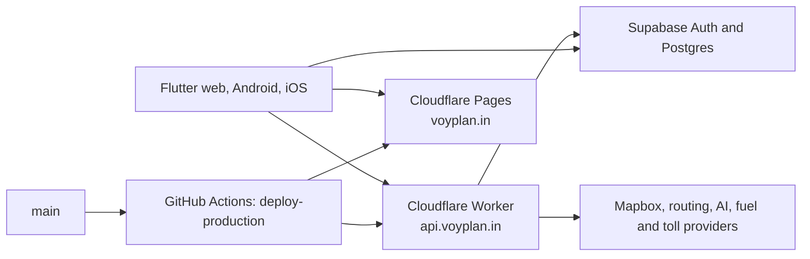

# VoyPlan Architecture

## Production topology

VoyPlan has one production branch and one deployment pipeline.

| Component | Service | Responsibility |
|---|---|---|
| Web application | Cloudflare Pages | Serves the Flutter web build and SPA fallback at `voyplan.in`. |
| API | Cloudflare Worker / Hono | Serves `api.voyplan.in`, validates requests, applies CORS/rate limits, and calls external services. |
| Client | Flutter | One codebase for web, Android, and iOS. |
| Identity and data | Supabase | GoTrue authentication and Postgres with RLS. |
| CI/CD | GitHub Actions | Tests pull requests and deploys Worker then Pages from `main`. |

`backend/` remains in the repository only as a migration reference. It is not part of the production request path or deployment workflow.

## Request and authentication flow

1. Flutter signs users in directly with Supabase Auth.
2. Supabase returns an access token managed by the client SDK.
3. The client calls `https://api.voyplan.in` with `Authorization: Bearer <token>`.
4. The Worker verifies the token through Supabase before serving protected routes.
5. Supabase RLS remains the final data-access boundary.

## Deployment order

The production workflow validates credentials, installs the locked Worker dependencies, deploys the Worker, and requires a successful `/health` response before it builds and uploads the Pages bundle. It then confirms the Pages project and verifies the live site. This order prevents a new frontend from being published against an unverified API.
