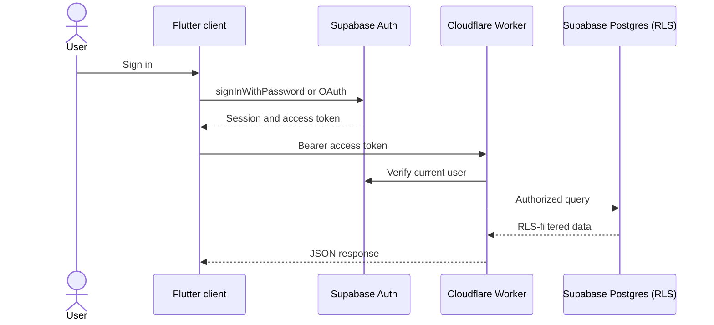

# VoyPlan Authentication

VoyPlan uses Supabase GoTrue Auth across the Flutter web, Android, and iOS clients. The Cloudflare Worker verifies protected requests with Supabase before processing them.

## Client behavior

- Credentials go directly to Supabase over TLS; the app never sends passwords to the Worker.
- The Flutter Supabase client is the single owner of sign-in, OAuth callbacks,
  session persistence, refresh and logout. The static landing page only links
  to `/app/?auth=login`; it never creates a second Supabase client or copies
  browser tokens.
- `AuthSession` mirrors the SDK's one auth-state stream, and `AuthRoute` gates
  the root screen: loading → login or dashboard. The dashboard is therefore
  never rendered while the initial session is unresolved or absent.
- Google uses PKCE and returns to the exact Flutter `/app/` URL that initiated
  sign-in, preserving valid app deep-link query parameters.

## Worker behavior

Protected Worker routes use the `Authorization: Bearer <access-token>` header. The Worker asks Supabase for the current user, returns `401` for missing or invalid tokens, and marks authenticated responses `Cache-Control: private, no-store`.

## Production configuration

The Worker requires correct `SUPABASE_URL` and `SUPABASE_ANON_KEY` bindings. Privileged tasks require `SUPABASE_SERVICE_ROLE_KEY` as a Worker secret. Supabase RLS policies remain the data-access control boundary.

In **Supabase Dashboard → Authentication → URL Configuration**, configure:

- Site URL: `https://voyplan.in/app/`
- Redirect URLs: `https://voyplan.in/app/*` and, if `www` remains live,
  `https://www.voyplan.in/app/*`
- Native redirect URL: `io.github.gowtham64.travelapp://login-callback/`

In **Authentication → Providers → Google**, enable Google and use the callback
URL Supabase supplies for the production project. The Google Cloud OAuth client
must contain that same Supabase callback URL. These dashboard settings cannot
be changed from this repository, so they must be confirmed before deployment.
