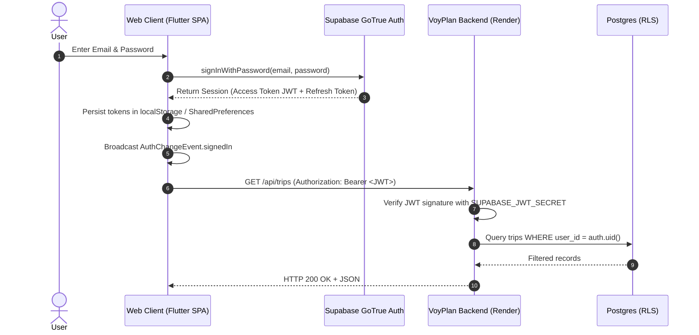

# VoyPlan Authentication Guide & P0 Post-Mortem

## 1. Authentication Architecture

VoyPlan uses **Supabase GoTrue Auth** as the identity and authentication engine across Web, Android, and iOS.



---

## 2. Authentication Modes

1. **Email & Password Authentication**:
   - Client sends credentials over TLS directly to Supabase Auth.
   - Passwords are never stored or handled by the Node.js backend.
   - New registrations create a user record in `auth.users` and non-sensitive user metadata in `public.user_details`.

2. **Guest Mode**:
   - Users can explore itineraries without signing in (`?guest=true`).
   - Guest state is held in client memory/local storage; cloud synchronization is enabled upon subsequent sign up.

3. **OAuth (Google / Apple)**:
   - Configured via Supabase OAuth providers with redirect URI set to `https://voyplan.in`.

---

## 3. The P0 Infinite Redirect Loop: Root Cause & Resolution

### Symptom
Users logging in or navigating to `https://voyplan.in` experienced a page that continuously reloaded in an infinite loop, preventing access to the planner and draining browser resources.

### Root Cause Analysis
1. In commits `0a76ff4` and `2eeecdd`, `web/index.html` was edited to update `APP_URL`:
   ```javascript
   // BROKEN CODE:
   const APP_URL = 'https://voyplan.in/';
   ```
2. When a user authenticated on `https://voyplan.in`, `initAuth()` detected the session in local storage and called:
   ```javascript
   goToApp(); // window.location.href = APP_URL;
   ```
3. Because `APP_URL` was `https://voyplan.in/`, the browser reloaded `https://voyplan.in/`.
4. Upon reload, `initAuth()` ran again, detected the same session, and called `goToApp()` again, creating an infinite redirect cycle.
5. In addition, `mobile/lib/main.dart`'s `_AuthStateWrapper` did not deterministically await `AuthChangeEvent.initialSession` on initial page load, causing a race condition where the unauthenticated login screen would flicker or display prematurely before local storage finished restoring.

### Permanent Code Fixes
1. **Dynamic URL Resolution & Loop Guard (`web/index.html`)**:
   ```javascript
   // PERMANENT FIX:
   const APP_URL = window.location.pathname.startsWith('/app')
       ? window.location.href
       : (window.location.origin ? `${window.location.origin}/app/` : 'https://voyplan.in/app/');

   function goToApp() {
       const target = APP_URL;
       if (window.location.href === target || window.location.pathname === '/app/' || window.location.pathname === '/app') {
           return; // Loop prevented!
       }
       window.location.href = target;
   }
   ```
2. **Deterministic Auth State Listener (`mobile/lib/main.dart`)**:
   - `_AuthStateWrapperState` now subscribes to `onAuthStateChange` in `initState()` and deterministically waits for `AuthChangeEvent.initialSession` before rendering either `HomeScreen()` or `LoginScreen()`.
   - All guest buttons and links have been updated to target `/app/?guest=true` instead of reloading `/`.
3. **Automated Regression Test**:
   - Added `mobile/test/auth_login_lifecycle_test.dart` containing 11 tests including redirect loop prevention, session restore, timeout handling, and token refresh.

---

## 4. Backend JWT Verification

In `backend/src/middleware/auth.js`:
- All protected API routes verify the incoming bearer token using `jsonwebtoken`:
  ```javascript
  const jwt = require('jsonwebtoken');
  const token = req.headers.authorization?.split(' ')[1];
  const decoded = jwt.verify(token, process.env.SUPABASE_JWT_SECRET);
  req.user = decoded;
  ```
- Any malformed or expired token returns `401 Unauthorized`.
