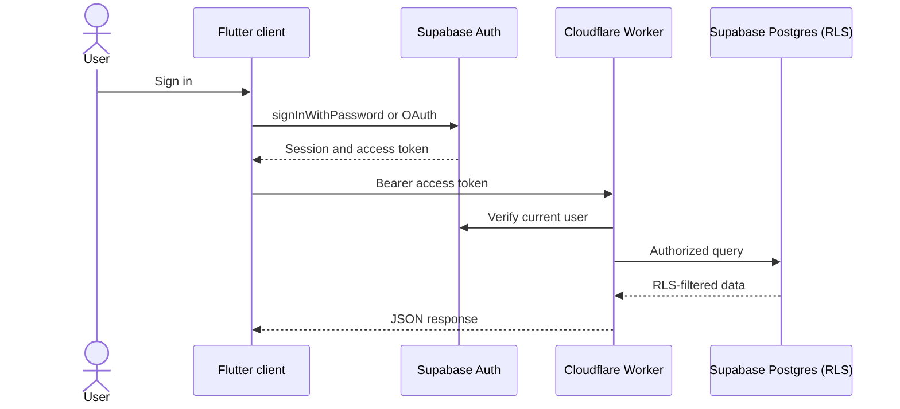

# VoyPlan Authentication

VoyPlan uses Supabase GoTrue Auth across the Flutter web, Android, and iOS clients. The Cloudflare Worker verifies protected requests with Supabase before processing them.

## Client behavior

- Credentials go directly to Supabase over TLS; the app never sends passwords to the Worker.
- The Supabase client SDK restores and refreshes sessions in platform storage.
- The app may offer guest exploration, but account-bound data requires a valid session.

## Worker behavior

Protected Worker routes use the `Authorization: Bearer <access-token>` header. The Worker asks Supabase for the current user, returns `401` for missing or invalid tokens, and marks authenticated responses `Cache-Control: private, no-store`.

## Production configuration

The Worker requires correct `SUPABASE_URL` and `SUPABASE_ANON_KEY` bindings. Privileged tasks require `SUPABASE_SERVICE_ROLE_KEY` as a Worker secret. Supabase RLS policies remain the data-access control boundary.
