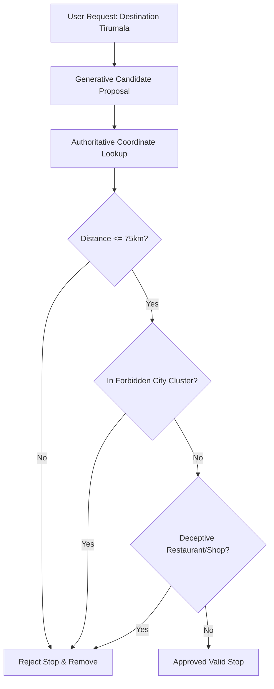

# VoyPlan Architecture — AI Itinerary & Deterministic Validation

## 1. Hybrid Generative + Deterministic Architecture
Generative LLMs excel at qualitative descriptions and thematic grouping, but hallucinate geography. VoyPlan implements a two-tier hybrid architecture:
1. **Tier 1 (Generative Proposal)**: LLM proposes candidate POIs and sightseeing blocks based on destination and categories.
2. **Tier 2 (Deterministic Grounding & Guardrails)**:
   - Coordinates resolved via authoritative geocoding.
   - Haversine distance ceiling strictly enforces $\le 75\text{ km}$ from the anchored destination.
   - Forbidden city cluster filters reject distant cities (Bengaluru, Mysuru, Chennai, Hyderabad).
   - Deceptive place filters reject commercial shops and restaurants masquerading as shrines.
   - Controlled 16-category taxonomy strictly enforces user selections.

## 2. Validation Flow Diagram

