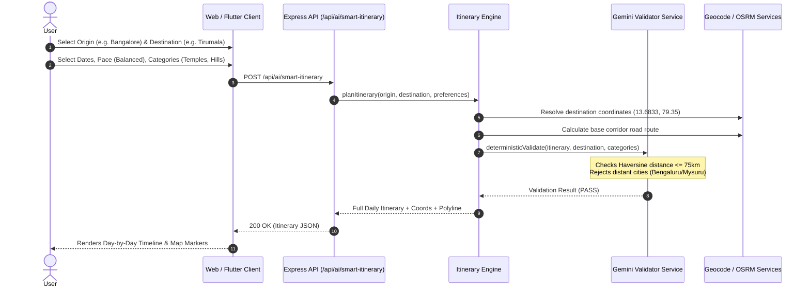
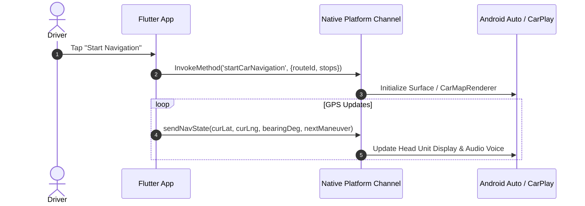

# VoyPlan — Real User Flows (Discovered from Codebase)

## Flow 1: Smart Itinerary Generation & Trip Anchoring

```mermaid
sequenceDiagram
    autonumber
    actor User
    participant Client as Web / Flutter Client
    participant API as Express API (/api/ai/smart-itinerary)
    participant Engine as Itinerary Engine
    participant Validator as Gemini Validator Service
    participant Geo as Geocode / OSRM Services

    User->>Client: Select Origin (e.g. Bangalore) & Destination (e.g. Tirumala)
    User->>Client: Select Dates, Pace (Balanced), Categories (Temples, Hills)
    Client->>API: POST /api/ai/smart-itinerary
    API->>Engine: planItinerary(origin, destination, preferences)
    Engine->>Geo: Resolve destination coordinates (13.6833, 79.35)
    Engine->>Geo: Calculate base corridor road route
    Engine->>Validator: deterministicValidate(itinerary, destination, categories)
    Note over Validator: Checks Haversine distance <= 75km<br/>Rejects distant cities (Bengaluru/Mysuru)
    Validator-->>Engine: Validation Result (PASS)
    Engine-->>API: Full Daily Itinerary + Coords + Polyline
    API-->>Client: 200 OK (Itinerary JSON)
    Client-->>User: Renders Day-by-Day Timeline & Map Markers
```

## Flow 2: Live Turn-by-Turn Navigation & Vehicle Bridge

```mermaid
sequenceDiagram
    autonumber
    actor Driver
    participant Mobile as Flutter App
    participant Bridge as Native Platform Channel
    participant Car as Android Auto / CarPlay

    Driver->>Mobile: Tap "Start Navigation"
    Mobile->>Bridge: InvokeMethod('startCarNavigation', {routeId, stops})
    Bridge->>Car: Initialize Surface / CarMapRenderer
    loop GPS Updates
        Mobile->>Bridge: sendNavState(curLat, curLng, bearingDeg, nextManeuver)
        Bridge->>Car: Update Head Unit Display & Audio Voice
    end
```
